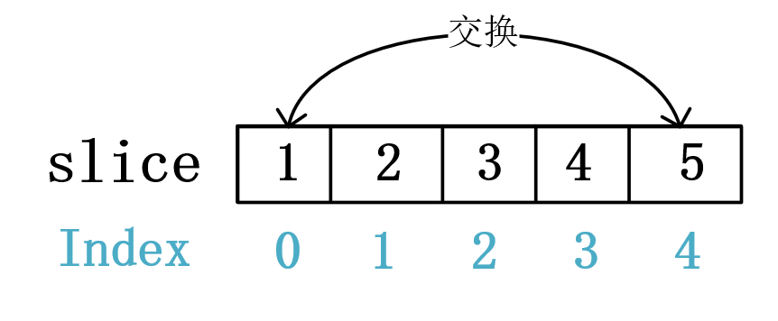
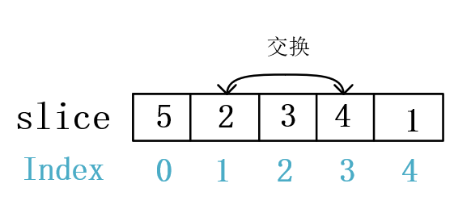

### 扑克牌洗牌
***
    使用费雪耶兹(Fisher-Yates)算法，它是一种随机置乱算法，也被称做高纳德(Knuth)置乱算法。用来将有限的序列随机打散无序化，生成一个随机序列。

***
    原理：对于一个有限序列，每次随机选出一个元素置于最后，然后除去最后这个元素之外的序列依次递归，只要保证每次“置后”是真正的随机选择，那么最终的序列就是原始序列的一个随机排列。所以算法不需要额外内存开销，复杂度O(n)。

***

### 解决思路

    第一次交换的取值范围是[0,4]，在此范围内随机取一张牌与最后一张牌交换

    第一次交换的取值范围是[0,3]，在此范围内随机取一张牌与倒数第二张牌交换

    依此类推，直到最后一交换，整个过程产生的结果有 len() ! =5！= 5 x 4 x 3 x 2 x 1 种